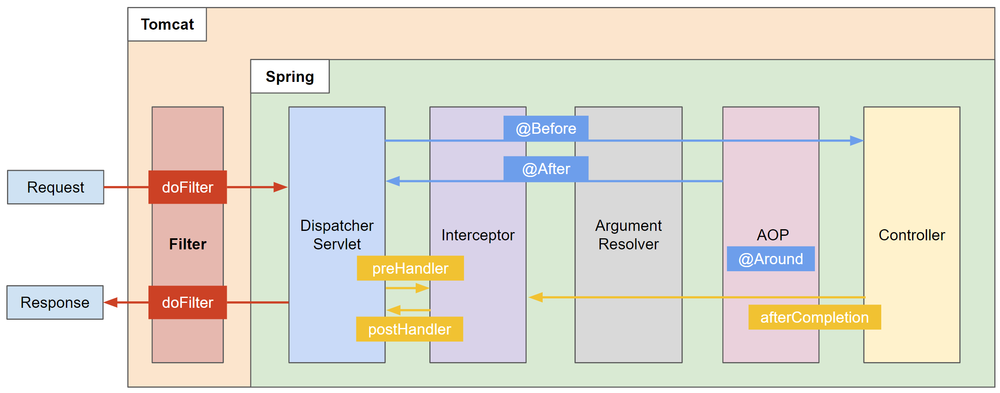
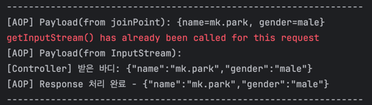
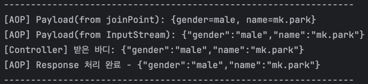
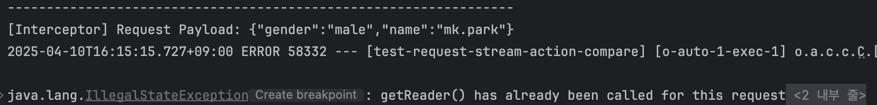
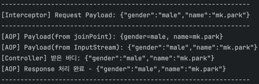

# 🔍 AOP 로깅 처리 방식 비교

요청 Body의 Payload를 로깅하기 위한 두 가지 방법에 대해 비교하고, Spring MVC의 처리 흐름에 따라 각각의 특징을 검증합니다.

## ✅ 비교 대상

AOP에서 요청 Payload를 로깅하는 방식은 아래 두 가지입니다:

1) `ProceedingJoinPoint` **사용**
2) `HttpServletRequest`**의** `InputStream` **사용**

### ⚙️ Spring MVC 요청 흐름

위 두 가지 방식은 Spring MVC 의 호출 흐름으로 인해 동작의 차이를 보입니다.

```aiignore
Filter → Interceptor → ArgumentResolver → AOP (Around) → Controller
```



- @RequestBody가 붙은 요청은 **ArgumentResolver에서 InputStream을 선점**하여 JSON을 객체로 변환합니다.
- 이로 인해, **InputStream은 한 번만 사용 가능**하며 재사용하려면 Wrapping이 필요합니다.

### 🔁 방법별 설명 및 차이점

**1) ProceedingJoinPoint 사용**

- 장점: ArgumentResolver가 이미 변환한 객체를 사용하므로 간편하고 안전
- 단점: AOP에 진입할 시점엔 이미 바인딩된 객체만 접근 가능하며, raw body를 얻을 수 없음

``` java
    @Around("execution(* com.example..*.controller..*(..))")
    public Object logRequestAndResponse(ProceedingJoinPoint joinPoint) throws Throwable {
        System.out.println("[AOP] Payload: " + joinPoint.getArgs()[0].toString());
        .
        .
    }
```

**2) HttpServletRequest InputStream 사용**

- 장점: 요청 본문의 원시 JSON 문자열을 직접 읽을 수 있음
- 단점: InputStream은 한 번만 읽을 수 있으며, ArgumentResolver나 Interceptor에서 이미 사용했을 경우 에러 발생
- 해결책: Filter에서 Request를 Wrapping 처리하여 복제 가능한 InputStream 제공

```java

@Around("execution(* com.example..*.controller..*(..))")
public Object logRequestAndResponse(ProceedingJoinPoint joinPoint) throws Throwable {
    HttpServletRequest request = ((ServletRequestAttributes) RequestContextHolder.currentRequestAttributes()).getRequest();
    System.out.println("[AOP] Payload: " + readBodyAsJsonString(request));
        .
        .
}

private String readBodyAsJsonString(HttpServletRequest request) throws IOException {
    StringBuilder sb = new StringBuilder();
    BufferedReader reader = request.getReader();    //ServletRequest Wrapper 미사용 시 에러발생 지점 "java.lang.IllegalStateException: getInputStream() has already been called for this request"
    String line;
    while ((line = reader.readLine()) != null) {
        sb.append(line);
    }
    return sb.toString();
}
```

### 그럼 무조건 ProceedingJoinPoint 매개변수를 사용하는 게 더 좋은가?

요청 Payload가 **AOP 내부에서만 사용된다면**, `joinPoint.getArgs()`를 활용하는 방식이 더 간단하고 안정적입니다.   
이 방식은 Spring의 ArgumentResolver가 이미 변환해준 객체를 그대로 사용할 수 있기 때문에, InputStream을 직접 다루지 않아도 되고, 재사용 문제도 발생하지 않습니다.

하지만, **Interceptor**나 **Filter** 등 AOP 외부에서도 요청 Body를 참조하거나 로깅해야 하는 경우에는, `HttpServletRequest.getInputStream()`을 사용해야 합니다.   
이 경우엔 반드시 **Request Wrapping**을 통해 InputStream을 복제하여, 여러 컴포넌트에서 안전하게 재사용할 수 있도록 해야 합니다.

요약하자면:

- AOP 단독 사용 → `joinPoint.getArgs()` 사용이 간편하고 안정적
- Interceptor, Filter와 함께 사용할 경우 → `InputStream` 사용 + Request Wrapping 필수


## 테스트

### 1) AOP

AOP 가 호출되기 전 ArgumentResolver 에서 Stream 을 사용했기 때문에 Request InputStream 을 읽을 때 **"getInputStream() has already been
called for this request" 에러가 발생** 합니다.

**실행**

```
gradlew :test --tests "com.example.testrequeststreamactioncompare.controller.DisableCachingTest.apiCall"
```

**결과**


### 2) AOP + Request Wrapping

Filter 레벨에서 Request Wrapping 을 통해 복제한 InputStream 데이터를 사용하기 떄문에 Request InputStream 을 읽을 때 오류가 발생하지 않습니다.

**실행**

```
gradlew :test --tests "com.example.testrequeststreamactioncompare.controller.EnableCachingTest.apiCall"
```

**결과**


### 3) AOP + Interceptor

Interceptor 에서 Stream 을 사용했기 떄문에 ArgumentResolver 에서 Request InputStream 을 읽으려 할 경우 **"getInputStream() has already been
called for this request" 에러가 발생** 합니다.
**실행**

```
gradlew :test --tests "com.example.testrequeststreamactioncompare.controller.DisableCachingAndEnableInterceptorTest"
```

**결과**


### 4) AOP + Interceptor + Request Wrapping

Filter 레벨에서 Request Wrapping 을 통해 복제한 InputStream 데이터를 사용하기 떄문에 Request InputStream 을 읽을 때 오류가 발생하지 않습니다.

**실행**

```
gradlew :test --tests "com.example.testrequeststreamactioncompare.controller.EnableCachingAndEnableInterceptorTest"
```

**결과**



--- 

## ✅ 결론

- **AOP**에서 `joinPoint.getArgs()` **사용**:
    - 가장 간편하고 안전한 방식.
    - 단, 원시 JSON 문자열은 얻기 어려움.
- `HttpServletRequest.getInputStream()` **사용**:
    - 원시 JSON을 로그로 남기거나, Interceptor에서 사용할 경우 적합.
    - 다만 **Request Wrapping 필수**.

--- 

## 🔗참고 자료

* [Spring MVC Workflow](https://pabeba.tistory.com/207)
* [Spring MVC Workflow with ArgumentResolver](https://velog.io/@tmddus2123/spring-FilterInterceptorArgument-Resolver-%EC%A0%9C%EB%8C%80%EB%A1%9C-%EC%95%8C%EC%95%84%EB%B3%B4%EC%9E%90)
* [ArgumentResolver의 동작 원리](https://youseong.tistory.com/31)
* [ArgumentResolver와 메시지컨버터](https://velog.io/@uiurihappy/Spring-Argument-Resolver-%EC%A0%81%EC%9A%A9%ED%95%98%EC%97%AC-%EC%9C%A0%EC%A0%80-%EC%A0%95%EB%B3%B4-%EB%B6%88%EB%9F%AC%EC%98%A4%EA%B8%B0)
